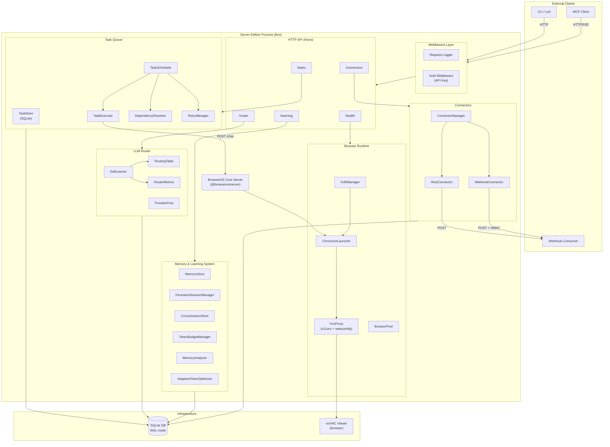
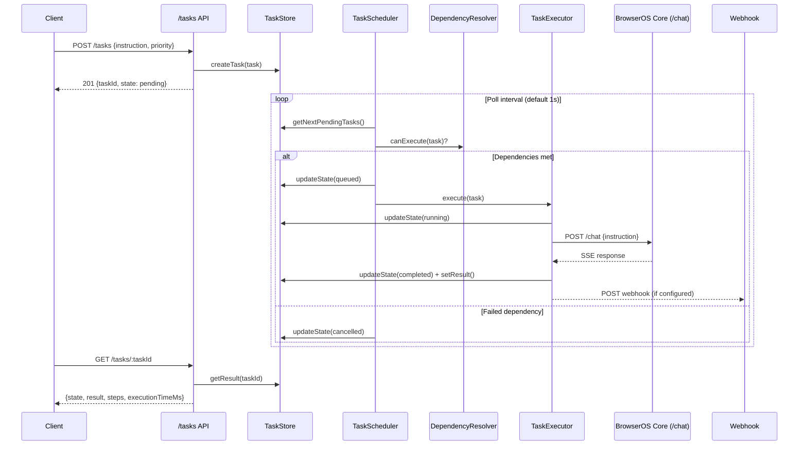
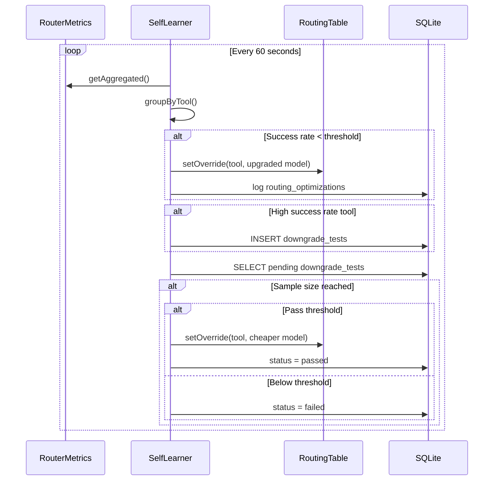

# BrowserOS Server Edition -- Architecture Documentation

Version 0.0.1 | License: AGPL-3.0-or-later

---

## Table of Contents

1. [System Overview](#1-system-overview)
2. [Architecture Diagrams](#2-architecture-diagrams)
3. [Module Documentation](#3-module-documentation)
4. [API Reference](#4-api-reference)
5. [Deployment Guide](#5-deployment-guide)
6. [Development Guide](#6-development-guide)

---

## 1. System Overview

### What Is BrowserOS Server Edition?

BrowserOS Server Edition is a headless browser automation engine that wraps the core BrowserOS server into a self-contained, deployable service. It provides:

- A managed Chromium instance with Chrome DevTools Protocol (CDP) access
- An HTTP/SSE API for submitting and monitoring browser automation tasks
- A persistent task queue with priority scheduling, dependency resolution, and retry logic
- An intelligent LLM router that selects the optimal provider/model per tool and self-optimizes over time
- A memory and learning system that persists session context, cross-session knowledge, and adaptively manages token budgets
- A connector system for broadcasting task events to external services via REST or webhooks

### Operating Modes

| Mode | Display | Xvfb | VNC | Typical Use |
|------|---------|------|-----|-------------|
| `local` | Native macOS display | No | No | Development on macOS; Chromium renders to the host display |
| `server` | Virtual framebuffer (`:99`) | Yes | Optional | Headless Linux deployment; Chromium renders to Xvfb, optionally viewable via noVNC |

The mode is selected via the `BROWSEROS_MODE` environment variable (default `local`) or the `--mode` CLI flag.

### Key Technologies

| Component | Technology |
|-----------|------------|
| Runtime | [Bun](https://bun.sh) (required) |
| HTTP Framework | [Hono](https://hono.dev) |
| Database | SQLite via `bun:sqlite` (WAL mode) |
| Validation | [Zod](https://zod.dev) |
| Logging | [Pino](https://getpino.io) + structured JSON request logger |
| Browser | Chromium (with BrowserOS controller extension) |
| Virtual Display | Xvfb |
| Remote Viewing | x11vnc + websockify + noVNC |

### Startup Sequence

The `ServerEdition` class orchestrates startup in this order:

1. **Xvfb** -- Start virtual framebuffer (server mode only)
2. **Chromium** -- Launch browser with CDP enabled and the controller extension loaded
3. **BrowserOS Server** -- Start the core `@browseros/server` Application (Hono HTTP + MCP tools)
4. **Middleware** -- Apply request logging and optional API key authentication
5. **VNC** -- Start x11vnc and websockify proxy (server mode, when enabled)
6. **Task Queue** -- Initialize SQLite-backed task store and priority scheduler
7. **LLM Router** -- Initialize routing table, metrics, and self-learning loop
8. **Memory System** -- Initialize memory store, session manager, cross-session store, token budget manager, memory analyzer, and adaptive optimizer
9. **Connectors** -- Initialize connector manager with REST and webhook factories
10. **Health Routes** -- Mount health/readiness/liveness endpoints

Shutdown proceeds in reverse order, with graceful termination and fallback force-kill timeouts.

---

## 2. Architecture Diagrams

### High-Level Component Diagram



### Data Flow: Task Execution



### Data Flow: LLM Router Self-Learning



---

## 3. Module Documentation

### 3.1 Browser Runtime

**Directory:** `src/browser-runtime/`

#### XvfbManager (`xvfb-manager.ts`)

Manages a virtual X11 framebuffer for headless Chromium rendering on Linux.

| Method | Description |
|--------|-------------|
| `start()` | Spawns `Xvfb` with the configured display number and resolution. Waits 1 second for startup confirmation. |
| `stop()` | Sends SIGTERM, falls back to SIGKILL after 5 seconds. |
| `isRunning()` | Returns true if the child process is alive. |
| `getDisplay()` | Returns the display string (e.g., `:99`). |

**Configuration:**

| Field | Type | Default | Description |
|-------|------|---------|-------------|
| `display` | `string` | `:99` | X display number |
| `resolution` | `string` | `1920x1080x24` | Screen dimensions and color depth |

Xvfb is only started in `server` mode. In `local` mode, Chromium renders to the host display.

#### ChromiumLauncher (`chromium-launcher.ts`)

Launches and manages a Chromium process with CDP enabled.

| Method | Description |
|--------|-------------|
| `launch()` | Detects or uses configured Chromium path, spawns with CDP port, loads the BrowserOS controller extension. Polls `http://127.0.0.1:{cdpPort}/json/version` until CDP is ready (30s timeout). |
| `stop()` | Sends SIGTERM, falls back to SIGKILL after 10 seconds. |
| `isRunning()` | Returns true if the child process is alive. |
| `getPid()` | Returns the OS process ID. |

**Key Chromium flags:**

- `--remote-debugging-port` -- Enables CDP
- `--load-extension` -- Loads the BrowserOS controller extension
- `--disable-background-timer-throttling` -- Prevents throttling of background tabs
- `--disable-backgrounding-occluded-windows` -- Keeps occluded windows active
- `--disable-renderer-backgrounding` -- Prevents renderer process throttling
- `--disable-gpu` -- Applied in server mode (Xvfb has no GPU)

**Chromium auto-detection paths:**

| Platform | Paths checked |
|----------|---------------|
| macOS | `/Applications/Google Chrome.app/...`, `/Applications/Chromium.app/...`, `/Applications/BrowserOS.app/...` |
| Linux | `/usr/bin/chromium`, `/usr/bin/chromium-browser`, `/usr/bin/google-chrome`, `/usr/bin/google-chrome-stable` |

#### VncProxy (`vnc-proxy.ts`)

Provides remote visual access to the Xvfb display via a browser-accessible noVNC interface.

Runs two child processes:

1. **x11vnc** -- Captures the Xvfb display and serves VNC on port 5900
2. **websockify** -- Bridges WebSocket connections (port 6080 by default) to the VNC server, serving the noVNC web client

| Method | Description |
|--------|-------------|
| `start()` | Starts x11vnc and websockify sequentially. |
| `stop()` | Sends SIGTERM to both processes; SIGKILL fallback after 5 seconds each. |
| `isRunning()` | Returns true only if both processes are alive. |
| `getUrl()` | Returns the noVNC URL (e.g., `http://localhost:6080/vnc.html`). |

**Configuration:**

| Field | Type | Default | Description |
|-------|------|---------|-------------|
| `enabled` | `boolean` | `false` | Whether VNC is active |
| `port` | `number` | `6080` | WebSocket/noVNC port |
| `password` | `string?` | none | Optional VNC password; omitted means no-password mode |
| `display` | `string` | `:99` | Xvfb display to capture |

#### BrowserPool (`browser-pool.ts`)

Manages multiple Chromium instances for parallel task execution.

| Method | Description |
|--------|-------------|
| `createInstance(id?)` | Creates a new Chromium instance with an auto-assigned CDP port. Returns the instance ID. |
| `destroyInstance(id)` | Stops and removes a specific instance. |
| `getStatus()` | Returns all instances with their current status. |
| `getAvailable()` | Returns the ID of the first `ready` instance, or null. |
| `destroyAll()` | Shuts down all instances. |

Each instance gets a sequential CDP port starting from `basePort`. Pool enforces a `maxInstances` limit.

**Instance statuses:** `starting`, `ready`, `busy`, `error`, `stopped`

#### Types (`types.ts`)

Shared type definitions for the browser runtime: `BrowserInstance`, `XvfbConfig`, `ChromiumConfig`, `VncConfig`, `BrowserRuntimeConfig`.

---

### 3.2 Task Queue

**Directory:** `src/task-queue/`

The task queue provides persistent, priority-based task scheduling with dependency resolution and exponential backoff retries.

#### TaskStore (`task-store.ts`)

SQLite-backed persistence layer for tasks, results, steps, and batches.

**Tables:**

| Table | Purpose |
|-------|---------|
| `tasks` | Task definitions: instruction, priority, state, dependencies, retry config, metadata, LLM config |
| `task_results` | Execution results: output data, errors, timing |
| `task_steps` | Individual tool invocation steps within a task |
| `task_batches` | Batch metadata: webhook URL, parallelism setting |

**Key methods:**

| Method | Description |
|--------|-------------|
| `createTask(task)` | Inserts a new task with `pending` state. |
| `getTask(taskId)` | Retrieves a single task by ID. |
| `listTasks(filters)` | Lists tasks with optional state/priority/batch filters, pagination via limit/offset. |
| `updateState(taskId, state)` | Transitions a task to a new state. |
| `incrementRetry(taskId)` | Increments the retry counter; returns the new count. |
| `setResult(taskId, result)` | Upserts execution result (supports partial updates). |
| `addStep(taskId, step)` | Appends a tool invocation step. |
| `getResult(taskId)` | Returns full result including state, output, errors, timing, and all steps. |
| `getStats()` | Returns counts by state: pending, queued, running, completed, failed, cancelled. |
| `getNextPendingTasks(limit)` | Retrieves tasks ordered by priority (critical > high > normal > low), then creation time. |
| `createBatch(batchId, webhookUrl?, parallelism?)` | Creates a batch record. |
| `deleteTask(taskId)` | Cascading delete of task, results, and steps. |

**Priority ordering:** `critical` (0) > `high` (1) > `normal` (2) > `low` (3)

#### TaskScheduler (`task-scheduler.ts`)

Polling-based scheduler that dispatches tasks to the executor while respecting concurrency limits and dependencies.

| Method | Description |
|--------|-------------|
| `start()` | Begins polling at the configured interval (default from shared constants). |
| `stop()` | Stops the polling timer; waits for any in-flight poll to complete. |
| `onEvent(handler)` | Registers an event handler for task lifecycle events. |
| `cancelTask(taskId)` | Cancels a running or pending task. |

**Poll cycle:**

1. Skip if already at max concurrency
2. Fetch candidate tasks (2x the available slots)
3. Load dependency tasks from the store
4. For each candidate:
   - If any dependency failed/cancelled: cancel the task
   - If dependencies not all completed: mark as `waiting_dependency`
   - Otherwise: mark as `queued` and dispatch to executor

**Event handling:** On `task.failed`, the scheduler checks the retry manager. If retries remain, it waits (backoff) then resets the task to `pending`. Otherwise, the event propagates to registered handlers.

#### TaskExecutor (`task-executor.ts`)

Executes tasks by sending the instruction to the BrowserOS core `/chat` endpoint and parsing the SSE response.

| Method | Description |
|--------|-------------|
| `execute(task)` | Runs the task with an AbortController for timeout and cancellation support. |
| `cancelTask(taskId)` | Aborts a running task via its AbortController. |

**Execution flow:**

1. Set state to `running`, record start time
2. POST to `http://127.0.0.1:{serverPort}/chat` with the task instruction, conversation ID, and optional LLM config
3. Parse the SSE text response (extracts JSON data events, returns the last one)
4. On success: set state to `completed`, store result and execution time
5. On failure: set state to `failed`, store error
6. If a `webhookUrl` is configured on the task, POST the result (fire-and-forget)

#### DependencyResolver (`dependency-resolver.ts`)

Determines whether a task's dependencies are satisfied.

| Method | Description |
|--------|-------------|
| `canExecute(task, allTasks)` | Returns true if all `dependsOn` tasks are `completed`. |
| `hasFailedDependency(task, allTasks)` | Returns true if any dependency is `failed` or `cancelled`. |
| `detectCycle(tasks)` | DFS-based cycle detection across all tasks. Returns the cycle path or null. |
| `getExecutableTaskIds(tasks)` | Returns IDs of all pending/queued tasks whose dependencies are met. |

#### RetryManager (`retry-manager.ts`)

Manages exponential backoff retry logic.

| Method | Description |
|--------|-------------|
| `shouldRetry(retryCount, policy?)` | Returns true if retries remain (default max from shared constants). |
| `getBackoffMs(retryCount, policy?)` | Calculates delay: `base * multiplier^retryCount`, capped at max backoff. |
| `waitForRetry(retryCount, policy?)` | Sleeps for the calculated backoff duration. |

**Defaults (from `@browseros/shared/constants/task-queue`):** Configurable base delay, multiplier, and maximum backoff ceiling.

---

### 3.3 LLM Router

**Directory:** `src/router/`

The LLM router selects the optimal LLM provider and model for each browser automation tool. It supports static configuration, real-time metrics tracking, and autonomous self-optimization.

#### LLMRouter (`llm-router.ts`)

Facade class that coordinates routing, metrics, provider management, and self-learning.

| Method | Description |
|--------|-------------|
| `route(toolName)` | Returns a `RouteDecision` for the given tool. Checks overrides, defaults, then falls back. If the chosen provider is unavailable, tries alternatives. |
| `buildConfigForTool(toolName)` | Returns a full `LLMConfig` (provider + credentials + model) for a tool. |
| `recordMetric(entry)` | Records a metric data point (tool, provider, model, success, latency, cost). |
| `getMetrics(toolName?)` | Returns aggregated metrics, optionally filtered by tool. |
| `getRoutingTable()` | Returns the full routing table with override indicators. |
| `registerProvider(creds)` | Registers a new LLM provider with credentials. |
| `startSelfLearning()` | Begins the periodic self-learning optimization loop. |
| `stopSelfLearning()` | Stops the optimization loop. |
| `close()` | Stops self-learning and closes the database. |

#### RoutingTable (`routing-table.ts`)

Maps tool names to LLM provider/model pairs using a two-layer system: default mappings and learned overrides.

**Resolution order:**

1. Check persisted overrides (learned optimizations)
2. Check default mappings from `@browseros/shared/constants/router`
3. Fallback to `anthropic` / `claude-sonnet-4-5-20250929`

**Pattern matching:** Supports exact match and wildcard patterns (e.g., `browser_tab_*` matches `browser_tab_close`).

**Persistence:** Overrides are stored in the `routing_overrides` SQLite table and survive restarts.

| Method | Description |
|--------|-------------|
| `resolve(toolName)` | Returns a `RouteDecision` with provider, model, and reason. |
| `setOverride(toolPattern, provider, model, reason?)` | Persists a routing override. |
| `removeOverride(toolPattern)` | Removes a persisted override. |
| `getAll()` | Returns all entries (defaults merged with overrides). |

#### ProviderPool (`provider-pool.ts`)

Registry of LLM provider credentials.

| Method | Description |
|--------|-------------|
| `register(creds)` | Adds a provider's credentials. |
| `registerMultiple(credsList)` | Batch registration. |
| `get(provider)` | Returns credentials for a provider. |
| `isAvailable(provider)` | Returns true if the provider is registered. |
| `getAvailableProviders()` | Lists all registered provider names. |
| `buildLLMConfig(provider, model)` | Constructs an `LLMConfig` object from stored credentials. |

**Supported credential fields:** `apiKey`, `baseUrl`, `resourceName`, `region`, `accessKeyId`, `secretAccessKey`, `sessionToken` (for AWS-style providers).

#### RouterMetrics (`router-metrics.ts`)

Collects and aggregates per-tool, per-provider performance metrics.

**SQLite table: `router_metrics`**

| Column | Type | Description |
|--------|------|-------------|
| `tool_name` | TEXT | Tool that was invoked |
| `provider` | TEXT | LLM provider used |
| `model` | TEXT | Model used |
| `success` | INTEGER | 1 = success, 0 = failure |
| `latency_ms` | INTEGER | Response time |
| `estimated_cost` | REAL | Estimated API cost |
| `timestamp` | TEXT | ISO 8601 timestamp |

| Method | Description |
|--------|-------------|
| `record(entry)` | Inserts a metric row. |
| `getAggregated(toolName?, since?)` | Returns per-tool, per-provider aggregates: total calls, success/failure counts, success rate, average latency, total cost, last used. |
| `getTotalCalls()` | Returns the global call count. |
| `cleanup(olderThanDays)` | Deletes metrics older than N days (default 30). |

#### SelfLearner (`self-learner.ts`)

Autonomous optimization loop that adjusts routing based on observed performance.

**Two optimization strategies:**

1. **Auto-upgrade:** If a tool's success rate drops below the upgrade threshold, the router switches to a more capable model (haiku -> sonnet -> opus).
2. **Downgrade testing:** If a tool has consistently high success (>= 95% over 20+ calls) with an expensive model (opus/sonnet), the learner schedules a test with the next cheaper model. If the test passes (meets the keep threshold), the cheaper model becomes the new default.

| Method | Description |
|--------|-------------|
| `start()` | Begins periodic optimization (default every 60 seconds). |
| `stop()` | Stops the optimization timer. |
| `runOptimization()` | Manually triggers one optimization cycle. |
| `recordDowngradeTestResult(toolName, model, success)` | Feeds a test result into an active downgrade test. |
| `getHistory(limit)` | Returns the optimization history log. |

**SQLite tables:**

- `routing_optimizations` -- Audit log of all routing changes (old/new provider/model, reason, rates, savings)
- `downgrade_tests` -- Active and completed downgrade test records

---

### 3.4 Memory & Learning System

**Directory:** Uses `@browseros/learning/memory/` package, integrated in `server-edition.ts`

The memory system provides multi-tier context management for browser automation sessions.

#### MemoryStore

In-session memory with short-term and long-term tiers. Configured with:

| Parameter | Value | Description |
|-----------|-------|-------------|
| `maxShortTermTokens` | 190,000 | Maximum tokens in short-term memory |
| `compressionThreshold` | 0.7 | Compress when 70% of budget is used |
| `analysisInterval` | 20 | Analyze every 20 entries |
| `embeddingDimension` | 384 | Vector dimension for similarity search |

#### PersistentSessionManager

Persists conversation sessions to SQLite. Sessions survive server restarts. Provides `getOrCreate(conversationId)` and `listSessions(limit)`.

#### CrossSessionStore

Stores knowledge that spans across sessions. Knowledge is categorized:

| Category | Description |
|----------|-------------|
| `domain` | Domain-specific knowledge |
| `execution_pattern` | Learned task execution patterns |
| `user_preference` | User preferences and settings |
| `website_knowledge` | Knowledge about specific websites |
| `error_pattern` | Known error patterns and resolutions |

Supports text-based search with category filtering and usage tracking.

#### TokenBudgetManager

Estimates token counts and tracks budget utilization. Provides `estimateTokens(text)`, `getStatus(totalTokens)`, and `getAvailableBudget()`.

#### MemoryAnalyzer

Analyzes memory entries against the current budget to identify optimization opportunities (compression candidates, entries to drop, etc.).

#### AdaptiveTokenOptimizer

Runs every 2 minutes (auto-started during initialization). Combines the MemoryStore, MemoryAnalyzer, and TokenBudgetManager to automatically adjust memory parameters based on observed usage patterns.

| Method | Description |
|--------|-------------|
| `start()` | Begins the 2-minute optimization cycle. |
| `stop()` | Stops the cycle. |
| `runOptimization(sessionId?)` | Triggers a manual optimization run. |
| `getCurrentParameters()` | Returns the current adaptive parameters. |
| `getEfficiencyReport()` | Returns an efficiency analysis report. |
| `getHistory(limit)` | Returns the optimization history. |

---

### 3.5 Connectors

**Directory:** `src/connectors/`

Connectors broadcast task lifecycle events to external systems.

#### ConnectorManager (`connector-manager.ts`)

Central registry and dispatcher for connectors.

| Method | Description |
|--------|-------------|
| `registerFactory(type, factory)` | Registers a factory function for a connector type. |
| `addConnector(type, name, config)` | Creates and initializes a new connector instance. Returns the connector ID. |
| `removeConnector(id)` | Shuts down and removes a connector. |
| `broadcast(event)` | Sends an event to all enabled connectors. Returns a map of connector ID to success/failure. |
| `listConnectors()` | Returns all connector configurations. |
| `getHealth(id)` | Runs a health check on a specific connector. |
| `setEnabled(id, enabled)` | Enables or disables a connector. |
| `shutdownAll()` | Gracefully shuts down all connectors and closes the database. |

**Persistence:** Connector configurations are stored in the `connectors` SQLite table.

**Supported event types:** `task_completed`, `task_failed`, `batch_completed`, `pattern_learned`, `experiment_concluded`

**Registered connector types (at startup):** `rest`, `webhook`

**Planned connector types (interface defined):** `github`, `slack`, `linear`, `n8n`, `bullmq`

#### Connector Interface (`connector-interface.ts`)

All connectors implement:

```typescript
interface Connector {
  readonly type: ConnectorType
  readonly name: string
  initialize(config: Record<string, unknown>): Promise<void>
  send(event: ConnectorEvent): Promise<boolean>
  healthCheck(): Promise<boolean>
  shutdown(): Promise<void>
}
```

#### RestConnector (`rest/rest-connector.ts`)

Sends events as JSON POST requests to a configured base URL with optional custom headers.

**Configuration:**

| Field | Type | Description |
|-------|------|-------------|
| `baseUrl` | `string` | Target URL for event delivery |
| `headers` | `Record<string, string>` | Additional HTTP headers |

#### WebhookConnector (`webhook/webhook-connector.ts`)

Sends events as JSON POST requests with optional HMAC-SHA256 signature verification and event type filtering.

**Configuration:**

| Field | Type | Description |
|-------|------|-------------|
| `url` | `string` | Webhook endpoint URL |
| `secret` | `string` | HMAC-SHA256 signing secret (optional) |
| `events` | `string[]` | Event types to deliver (empty = all) |

When a secret is configured, the connector adds an `X-Signature-256` header with `sha256={hex_signature}` computed over the JSON body.

---

### 3.6 API Routes

**Directory:** `src/api/`

All routes are mounted on the core BrowserOS Hono application as sub-routers.

#### Health Routes (`health-routes.ts`)

Mounted at `/health`. Excluded from API key authentication.

#### Task Routes (`task-routes.ts`)

Mounted at `/tasks`. Uses Zod schemas from `@browseros/shared/schemas/task` for request validation.

#### Router Routes (`router-routes.ts`)

Mounted at `/router`. Provides read-only access to routing configuration and metrics.

#### Learning Routes (`learning-routes.ts`)

Mounted at `/learning`. Provides access to the memory system, sessions, cross-session knowledge, and the adaptive optimizer.

#### Connector Routes (`connector-routes.ts`)

Mounted at `/connectors`. CRUD operations for external service connectors.

#### Browser Routes (`browser-routes.ts`)

Provides browser pool management (create/destroy/list instances). Not currently mounted in the main startup sequence (available for future multi-browser support).

---

### 3.7 Middleware

**Directory:** `src/middleware/`

#### Auth Middleware (`auth.ts`)

API key authentication middleware. Checks for a key in either the `X-API-Key` header or the `Authorization: Bearer {key}` header.

- Enabled when `API_KEYS` environment variable is set (comma-separated list of valid keys)
- The `/health` path is excluded from authentication
- Returns `401 Unauthorized` with `{"error": "Unauthorized"}` on failure

#### Request Logger (`request-logger.ts`)

Structured JSON logging middleware applied to all routes.

Each request produces a log entry with:

| Field | Description |
|-------|-------------|
| `level` | `error` (5xx), `warn` (4xx), `info` (2xx/3xx) |
| `msg` | `{METHOD} {path}` |
| `requestId` | From `X-Request-ID` header or auto-generated UUID |
| `method` | HTTP method |
| `path` | Request path |
| `status` | Response status code |
| `durationMs` | Request processing time in milliseconds |
| `timestamp` | ISO 8601 timestamp |

The middleware also sets the `X-Request-ID` response header for request tracing.

---

### 3.8 Configuration & Environment

#### Environment Variables (`env.ts`)

All environment variables are validated with Zod at startup. Invalid values cause immediate failure with a descriptive error.

| Variable | Type | Default | Description |
|----------|------|---------|-------------|
| `BROWSEROS_MODE` | `local` or `server` | `local` | Operating mode |
| `XVFB_DISPLAY` | `string` | `:99` | X display number for Xvfb |
| `XVFB_RESOLUTION` | `string` | `1920x1080x24` | Virtual screen resolution |
| `VNC_ENABLED` | `boolean` | `false` | Enable VNC remote viewing |
| `VNC_PORT` | `number` | `6080` | noVNC WebSocket port |
| `VNC_PASSWORD` | `string?` | none | VNC password (omit for no auth) |
| `CHROMIUM_PATH` | `string?` | auto-detect | Path to Chromium executable |
| `CDP_PORT` | `number` | `9222` | Chrome DevTools Protocol port |
| `EXTENSION_PORT` | `number` | `9101` | Controller extension WebSocket port |
| `EXTENSION_DIR` | `string` | `apps/controller-ext/dist` | Relative path to extension build |
| `SERVER_PORT` | `number` | `9100` | HTTP API port |
| `DB_PATH` | `string` | `./data/browseros-server.db` | SQLite database file path |
| `TASK_QUEUE_MAX_CONCURRENT` | `number` | `1` | Max concurrent task executions |
| `TASK_QUEUE_MAX_RETRIES` | `number` | `3` | Default max retries per task |
| `TASK_DEFAULT_TIMEOUT_MS` | `number` | `120000` | Default task timeout (2 minutes) |
| `API_KEYS` | `string` | `""` (disabled) | Comma-separated API keys |
| `BROWSER_POOL_MAX` | `number` | `1` | Max browser instances in pool |
| `EXTENSION_PATH` | `string?` | none | Override path to controller extension |

#### Config (`config.ts`)

The `createConfig` function transforms environment variables into a structured `ServerEditionConfig` object. The CLI `--mode` flag overrides `BROWSEROS_MODE`.

**Auth logic:** Authentication is automatically enabled when `API_KEYS` is a non-empty string. The string is split by commas, and empty entries are filtered out.

---

## 4. API Reference

All endpoints are served from `http://127.0.0.1:{SERVER_PORT}` (default 9100).

When `API_KEYS` is configured, include one of:
- Header: `X-API-Key: {your-key}`
- Header: `Authorization: Bearer {your-key}`

### 4.1 Health Endpoints

#### GET /health

Returns system health with component checks.

**Response (200 or 503):**

```json
{
  "status": "healthy",
  "uptime": 3600,
  "version": "1.0.0",
  "checks": {
    "chromium": true,
    "taskQueue": true,
    "router": true,
    "memory": true
  },
  "timestamp": "2026-02-13T12:00:00.000Z"
}
```

```bash
curl http://localhost:9100/health
```

#### GET /health/ready

Readiness probe for container orchestrators.

**Response (200):**
```json
{ "ready": true }
```

```bash
curl http://localhost:9100/health/ready
```

#### GET /health/live

Liveness probe for container orchestrators.

**Response (200):**
```json
{ "live": true }
```

```bash
curl http://localhost:9100/health/live
```

---

### 4.2 Task Endpoints

#### POST /tasks

Submit a single automation task.

**Request body:**

| Field | Type | Required | Description |
|-------|------|----------|-------------|
| `instruction` | `string` | Yes | Natural language instruction for the browser agent |
| `priority` | `string` | No | `critical`, `high`, `normal` (default), `low` |
| `dependsOn` | `string[]` | No | Task IDs that must complete first |
| `retryPolicy` | `object` | No | `{maxRetries, backoffMs, backoffMultiplier}` |
| `timeout` | `number` | No | Timeout in milliseconds (default 120000) |
| `webhookUrl` | `string` | No | URL to POST results to on completion/failure |
| `metadata` | `object` | No | Arbitrary metadata |
| `llmConfig` | `object` | No | Override LLM provider/model for this task |

**Response (201):**
```json
{
  "taskId": "550e8400-e29b-41d4-a716-446655440000",
  "state": "pending",
  "createdAt": "2026-02-13T12:00:00.000Z"
}
```

```bash
curl -X POST http://localhost:9100/tasks \
  -H "Content-Type: application/json" \
  -H "X-API-Key: my-key" \
  -d '{
    "instruction": "Go to https://example.com and take a screenshot",
    "priority": "high",
    "timeout": 60000
  }'
```

#### POST /tasks/batch

Submit multiple tasks as a batch.

**Request body:**

| Field | Type | Required | Description |
|-------|------|----------|-------------|
| `tasks` | `array` | Yes | Array of task objects (same fields as single task) |
| `webhookUrl` | `string` | No | Webhook for batch-level notifications |
| `parallelism` | `number` | No | Max parallel execution within the batch (default 1) |

**Response (201):**
```json
{
  "batchId": "660e8400-e29b-41d4-a716-446655440000",
  "taskIds": ["...", "..."],
  "count": 2,
  "createdAt": "2026-02-13T12:00:00.000Z"
}
```

```bash
curl -X POST http://localhost:9100/tasks/batch \
  -H "Content-Type: application/json" \
  -H "X-API-Key: my-key" \
  -d '{
    "tasks": [
      {"instruction": "Navigate to https://example.com"},
      {"instruction": "Click the login button"}
    ],
    "parallelism": 1
  }'
```

#### GET /tasks

List tasks with optional filters.

**Query parameters:**

| Parameter | Type | Description |
|-----------|------|-------------|
| `state` | `string` | Filter by state |
| `priority` | `string` | Filter by priority |
| `batchId` | `string` | Filter by batch ID |
| `limit` | `number` | Page size (default 50) |
| `offset` | `number` | Pagination offset (default 0) |

**Response (200):**
```json
{
  "tasks": [
    {
      "taskId": "...",
      "instruction": "...",
      "priority": "normal",
      "state": "completed",
      "batchId": null,
      "retryCount": 0,
      "createdAt": "...",
      "updatedAt": "..."
    }
  ],
  "total": 42,
  "stats": {
    "total": 42,
    "pending": 2,
    "queued": 1,
    "running": 1,
    "completed": 35,
    "failed": 2,
    "cancelled": 1
  }
}
```

```bash
curl "http://localhost:9100/tasks?state=running&limit=10" \
  -H "X-API-Key: my-key"
```

#### GET /tasks/stats

Get queue statistics.

**Response (200):**
```json
{
  "total": 42,
  "pending": 2,
  "queued": 1,
  "running": 1,
  "completed": 35,
  "failed": 2,
  "cancelled": 1
}
```

```bash
curl http://localhost:9100/tasks/stats -H "X-API-Key: my-key"
```

#### GET /tasks/:taskId

Get task status and result.

**Response (200):**
```json
{
  "taskId": "...",
  "state": "completed",
  "result": { "screenshot": "data:image/png;base64,..." },
  "error": null,
  "startedAt": "2026-02-13T12:00:00.000Z",
  "completedAt": "2026-02-13T12:00:05.000Z",
  "retryCount": 0,
  "executionTimeMs": 5000,
  "steps": [
    {
      "tool": "browser_navigate",
      "args": { "url": "https://example.com" },
      "result": { "success": true },
      "durationMs": 2000,
      "timestamp": "..."
    }
  ]
}
```

**Response (404):**
```json
{ "error": "Task not found" }
```

```bash
curl http://localhost:9100/tasks/550e8400-e29b-41d4-a716-446655440000 \
  -H "X-API-Key: my-key"
```

#### DELETE /tasks/:taskId

Cancel a task.

**Response (200):**
```json
{
  "taskId": "...",
  "cancelled": true,
  "state": "cancelled"
}
```

```bash
curl -X DELETE http://localhost:9100/tasks/550e8400-e29b-41d4-a716-446655440000 \
  -H "X-API-Key: my-key"
```

#### POST /tasks/:taskId/retry

Retry a failed or cancelled task. Resets the task state to `pending`.

**Precondition:** Task must be in `failed` or `cancelled` state.

**Response (200):**
```json
{
  "taskId": "...",
  "state": "pending",
  "retryCount": 1
}
```

**Response (400):**
```json
{ "error": "Can only retry failed or cancelled tasks" }
```

```bash
curl -X POST http://localhost:9100/tasks/550e8400-e29b-41d4-a716-446655440000/retry \
  -H "X-API-Key: my-key"
```

---

### 4.3 Router Endpoints

#### GET /router

Get the full routing table.

**Response (200):**
```json
{
  "routes": [
    {
      "toolPattern": "browser_navigate",
      "provider": "anthropic",
      "model": "claude-sonnet-4-5-20250929",
      "category": "navigation",
      "isOverride": false
    },
    {
      "toolPattern": "browser_screenshot",
      "provider": "anthropic",
      "model": "claude-haiku-4-5-20251001",
      "category": "observation",
      "isOverride": true
    }
  ]
}
```

```bash
curl http://localhost:9100/router -H "X-API-Key: my-key"
```

#### GET /router/metrics

Get aggregated performance metrics.

**Query parameters:**

| Parameter | Type | Description |
|-----------|------|-------------|
| `tool` | `string` | Filter by tool name (optional) |

**Response (200):**
```json
{
  "metrics": [
    {
      "toolName": "browser_navigate",
      "provider": "anthropic",
      "model": "claude-sonnet-4-5-20250929",
      "totalCalls": 150,
      "successCount": 145,
      "failureCount": 5,
      "successRate": 0.967,
      "avgLatencyMs": 2340,
      "totalCost": 0.45,
      "lastUsed": "2026-02-13T12:00:00.000Z"
    }
  ]
}
```

```bash
curl "http://localhost:9100/router/metrics?tool=browser_navigate" \
  -H "X-API-Key: my-key"
```

#### GET /router/route/:toolName

Test routing for a specific tool.

**Response (200):**
```json
{
  "provider": "anthropic",
  "model": "claude-sonnet-4-5-20250929",
  "reason": "default"
}
```

Possible `reason` values: `default`, `optimized`, `fallback`, `downgrade_test`, `no_available_provider`

```bash
curl http://localhost:9100/router/route/browser_navigate \
  -H "X-API-Key: my-key"
```

#### GET /router/config/:toolName

Get the full LLM configuration for a tool (including credentials).

**Response (200):**
```json
{
  "provider": "anthropic",
  "model": "claude-sonnet-4-5-20250929",
  "apiKey": "sk-ant-...",
  "baseUrl": null
}
```

**Response (404):**
```json
{ "error": "No configuration available for tool" }
```

```bash
curl http://localhost:9100/router/config/browser_navigate \
  -H "X-API-Key: my-key"
```

---

### 4.4 Learning Endpoints

#### GET /learning/memory/stats

Get memory statistics.

**Query parameters:**

| Parameter | Type | Description |
|-----------|------|-------------|
| `sessionId` | `string` | Filter by session (optional) |

```bash
curl "http://localhost:9100/learning/memory/stats?sessionId=abc-123" \
  -H "X-API-Key: my-key"
```

#### GET /learning/memory

Get memory entries for a session.

**Query parameters:**

| Parameter | Type | Required | Description |
|-----------|------|----------|-------------|
| `sessionId` | `string` | Yes | Session/conversation ID |
| `type` | `string` | No | `short_term`, `long_term`, or `cross_session` |
| `limit` | `number` | No | Max entries to return |

**Response (200):**
```json
{
  "sessionId": "abc-123",
  "type": "all",
  "count": 15,
  "entries": [
    {
      "id": "...",
      "type": "short_term",
      "content": "User navigated to example.com",
      "role": "assistant",
      "relevanceScore": 0.85,
      "isCompressed": false,
      "createdAt": "..."
    }
  ]
}
```

```bash
curl "http://localhost:9100/learning/memory?sessionId=abc-123&type=short_term&limit=10" \
  -H "X-API-Key: my-key"
```

#### GET /learning/memory/budget

Get current token budget status for a session.

**Query parameters:**

| Parameter | Type | Required | Description |
|-----------|------|----------|-------------|
| `sessionId` | `string` | Yes | Session/conversation ID |

```bash
curl "http://localhost:9100/learning/memory/budget?sessionId=abc-123" \
  -H "X-API-Key: my-key"
```

#### POST /learning/memory/analyze

Trigger memory self-analysis for a session.

**Request body:**
```json
{ "sessionId": "abc-123" }
```

```bash
curl -X POST http://localhost:9100/learning/memory/analyze \
  -H "Content-Type: application/json" \
  -H "X-API-Key: my-key" \
  -d '{"sessionId": "abc-123"}'
```

#### GET /learning/sessions

List all persistent sessions.

**Query parameters:**

| Parameter | Type | Description |
|-----------|------|-------------|
| `limit` | `number` | Max sessions to return (default 50) |

**Response (200):**
```json
{
  "count": 5,
  "sessions": [
    {
      "conversationId": "abc-123",
      "messageCount": 42,
      "createdAt": "...",
      "updatedAt": "..."
    }
  ]
}
```

```bash
curl "http://localhost:9100/learning/sessions?limit=10" \
  -H "X-API-Key: my-key"
```

#### GET /learning/sessions/:conversationId

Get session details and history.

```bash
curl http://localhost:9100/learning/sessions/abc-123 \
  -H "X-API-Key: my-key"
```

#### GET /learning/knowledge

Search cross-session knowledge.

**Query parameters:**

| Parameter | Type | Required | Description |
|-----------|------|----------|-------------|
| `q` | `string` | Yes | Search query |
| `category` | `string` | No | `domain`, `execution_pattern`, `user_preference`, `website_knowledge`, `error_pattern` |
| `limit` | `number` | No | Max results (default 20) |

**Response (200):**
```json
{
  "query": "login",
  "category": "all",
  "count": 3,
  "results": [
    {
      "id": "...",
      "category": "website_knowledge",
      "key": "example.com/login",
      "value": "Login form uses email + password, submit button id='login-btn'",
      "confidence": 0.95,
      "usageCount": 12,
      "lastUsedAt": "...",
      "createdAt": "..."
    }
  ]
}
```

```bash
curl "http://localhost:9100/learning/knowledge?q=login&category=website_knowledge" \
  -H "X-API-Key: my-key"
```

#### GET /learning/knowledge/stats

Get cross-session knowledge statistics.

```bash
curl http://localhost:9100/learning/knowledge/stats \
  -H "X-API-Key: my-key"
```

#### POST /learning/knowledge

Store cross-session knowledge.

**Request body:**

| Field | Type | Required | Description |
|-------|------|----------|-------------|
| `category` | `string` | Yes | One of: `domain`, `execution_pattern`, `user_preference`, `website_knowledge`, `error_pattern` |
| `key` | `string` | Yes | Knowledge key/identifier |
| `value` | `string` | Yes | Knowledge content |
| `confidence` | `number` | No | Confidence score (0-1) |

**Response (201):**
```json
{
  "id": "...",
  "category": "website_knowledge",
  "key": "example.com/login",
  "stored": true
}
```

```bash
curl -X POST http://localhost:9100/learning/knowledge \
  -H "Content-Type: application/json" \
  -H "X-API-Key: my-key" \
  -d '{
    "category": "website_knowledge",
    "key": "example.com/login",
    "value": "Login form uses email + password",
    "confidence": 0.9
  }'
```

#### GET /learning/optimizer/status

Get adaptive optimizer current parameters and efficiency report.

**Response (200):**
```json
{
  "parameters": { ... },
  "efficiency": { ... }
}
```

```bash
curl http://localhost:9100/learning/optimizer/status \
  -H "X-API-Key: my-key"
```

#### POST /learning/optimizer/run

Trigger a manual optimization run.

**Request body (optional):**
```json
{ "sessionId": "abc-123" }
```

```bash
curl -X POST http://localhost:9100/learning/optimizer/run \
  -H "Content-Type: application/json" \
  -H "X-API-Key: my-key" \
  -d '{}'
```

#### GET /learning/optimizer/history

Get optimization history.

**Query parameters:**

| Parameter | Type | Description |
|-----------|------|-------------|
| `limit` | `number` | Max entries (default 20) |

```bash
curl "http://localhost:9100/learning/optimizer/history?limit=10" \
  -H "X-API-Key: my-key"
```

---

### 4.5 Connector Endpoints

#### GET /connectors

List all registered connectors.

**Response (200):**
```json
[
  {
    "id": "...",
    "type": "webhook",
    "name": "Slack Notifications",
    "enabled": true,
    "config": { "url": "https://hooks.slack.com/..." },
    "createdAt": "..."
  }
]
```

```bash
curl http://localhost:9100/connectors -H "X-API-Key: my-key"
```

#### POST /connectors

Register a new connector.

**Request body:**

| Field | Type | Required | Description |
|-------|------|----------|-------------|
| `type` | `string` | Yes | `rest` or `webhook` |
| `name` | `string` | Yes | Display name |
| `config` | `object` | No | Type-specific configuration |

**REST connector config:**
```json
{ "baseUrl": "https://api.example.com/events", "headers": { "Authorization": "Bearer token" } }
```

**Webhook connector config:**
```json
{ "url": "https://hooks.example.com/browseros", "secret": "my-signing-secret", "events": ["task_completed", "task_failed"] }
```

**Response (201):**
```json
{ "id": "...", "type": "webhook", "name": "My Webhook" }
```

```bash
curl -X POST http://localhost:9100/connectors \
  -H "Content-Type: application/json" \
  -H "X-API-Key: my-key" \
  -d '{
    "type": "webhook",
    "name": "CI/CD Pipeline",
    "config": {
      "url": "https://ci.example.com/webhook",
      "secret": "supersecret",
      "events": ["task_completed"]
    }
  }'
```

#### DELETE /connectors/:id

Remove a connector.

**Response (200):**
```json
{ "id": "...", "removed": true }
```

```bash
curl -X DELETE http://localhost:9100/connectors/550e8400-... \
  -H "X-API-Key: my-key"
```

#### GET /connectors/:id/health

Check connector health.

**Response (200):**
```json
{ "id": "...", "healthy": true }
```

```bash
curl http://localhost:9100/connectors/550e8400-.../health \
  -H "X-API-Key: my-key"
```

#### POST /connectors/:id/toggle

Enable or disable a connector.

**Request body:**
```json
{ "enabled": false }
```

**Response (200):**
```json
{ "id": "...", "enabled": false }
```

```bash
curl -X POST http://localhost:9100/connectors/550e8400-.../toggle \
  -H "Content-Type: application/json" \
  -H "X-API-Key: my-key" \
  -d '{"enabled": false}'
```

---

## 5. Deployment Guide

### 5.1 Docker Deployment

The project includes a multi-stage Dockerfile and a docker-compose configuration.

#### Build and Run with Docker Compose

```bash
cd apps/server-edition

# Start with default settings
docker compose up -d

# Start with a VNC password
VNC_PASSWORD=mysecret docker compose up -d

# View logs
docker compose logs -f

# Stop
docker compose down
```

The compose file exposes:
- Port **9100** -- HTTP API
- Port **6080** -- noVNC web viewer

Data is persisted in a named Docker volume `browseros-data`.

Resource limits: 4 GB memory limit, 1 GB reservation.

#### Build Standalone Image

```bash
# From the monorepo root
docker build -f apps/server-edition/Dockerfile -t browseros-server .

# Run
docker run -d \
  -p 9100:9100 \
  -p 6080:6080 \
  -e API_KEYS=my-secret-key \
  -e VNC_PASSWORD=vncsecret \
  -v browseros-data:/app/data \
  browseros-server
```

#### Dockerfile Overview

**Stage 1 (builder):**
- Base: `oven/bun:1.3`
- Installs dependencies with `bun install --frozen-lockfile`
- Builds the application with `bun build` (minified, Bun target)

**Stage 2 (runtime):**
- Base: `oven/bun:1.3`
- Installs system packages: `xvfb`, `chromium`, `x11vnc`, `novnc`, `websockify`, fonts, `dbus-x11`, `procps`, `curl`
- Copies built application, extension, and node_modules from builder
- Sets production environment defaults
- Health check: `curl -f http://localhost:9100/health` every 30 seconds

**Exposed ports:**
- 9100 -- HTTP API
- 6080 -- noVNC
- 5900 -- Raw VNC (not typically exposed)

### 5.2 Environment Configuration for Production

Minimum required environment variables for production:

```env
BROWSEROS_MODE=server
API_KEYS=your-secret-api-key-1,your-secret-api-key-2
DB_PATH=/app/data/browseros-server.db
```

Recommended additions:

```env
VNC_ENABLED=true
VNC_PASSWORD=strong-vnc-password
TASK_QUEUE_MAX_CONCURRENT=2
TASK_DEFAULT_TIMEOUT_MS=300000
```

### 5.3 Health Checks

The Docker image includes a built-in health check. For Kubernetes:

```yaml
livenessProbe:
  httpGet:
    path: /health/live
    port: 9100
  initialDelaySeconds: 30
  periodSeconds: 10

readinessProbe:
  httpGet:
    path: /health/ready
    port: 9100
  initialDelaySeconds: 30
  periodSeconds: 5
```

### 5.4 Data Persistence

All persistent state is stored in a single SQLite database file at `DB_PATH`. This file contains:

- Task definitions, results, and steps
- Batch records
- LLM routing overrides and metrics
- Routing optimization history and downgrade test records
- Connector configurations
- Memory entries, sessions, and cross-session knowledge
- Adaptive optimizer parameters and history

Back up this file for full state recovery.

---

## 6. Development Guide

### 6.1 Prerequisites

- **Bun** >= 1.3 ([install](https://bun.sh))
- **Chromium** or Google Chrome (macOS: auto-detected; Linux: install `chromium`)
- For VNC testing on Linux: `xvfb`, `x11vnc`, `novnc`, `websockify`

### 6.2 Local Setup

```bash
# From monorepo root
bun install

# Start in local mode (uses your Mac's display)
cd apps/server-edition
bun run start:local

# Or with explicit mode
bun src/index.ts --mode=local
```

The server starts on `http://127.0.0.1:9100` by default. Chromium opens on your display with the BrowserOS controller extension loaded.

### 6.3 Running Tests

```bash
cd apps/server-edition
bun run test
```

### 6.4 Type Checking

```bash
cd apps/server-edition
bun run typecheck
```

### 6.5 Building

```bash
cd apps/server-edition
bun run build
# Output: dist/index.js
```

### 6.6 Adding a New Connector

1. Create a new directory under `src/connectors/` (e.g., `src/connectors/slack/`)
2. Implement the `Connector` interface from `src/connectors/connector-interface.ts`:

```typescript
import type { Connector, ConnectorEvent, ConnectorType } from '../connector-interface'

export class SlackConnector implements Connector {
  readonly type: ConnectorType = 'slack'
  readonly name = 'Slack'

  async initialize(config: Record<string, unknown>): Promise<void> {
    // Parse and store config (webhook URL, channel, etc.)
  }

  async send(event: ConnectorEvent): Promise<boolean> {
    // Format and send the event to Slack
    // Return true on success, false on failure
  }

  async healthCheck(): Promise<boolean> {
    // Verify the Slack webhook/API is reachable
  }

  async shutdown(): Promise<void> {
    // Clean up resources
  }
}
```

3. Register the factory in `src/server-edition.ts` inside `initializeConnectors()`:

```typescript
import { SlackConnector } from './connectors/slack/slack-connector'

// Inside initializeConnectors():
this.connectorManager.registerFactory('slack', () => new SlackConnector())
```

4. The connector is now available via the API:

```bash
curl -X POST http://localhost:9100/connectors \
  -H "Content-Type: application/json" \
  -d '{"type": "slack", "name": "Team Channel", "config": {"webhookUrl": "..."}}'
```

### 6.7 Adding a New API Route Group

1. Create a route file in `src/api/` (e.g., `src/api/my-routes.ts`):

```typescript
import { Hono } from 'hono'

export interface MyRoutesDeps {
  // Dependencies injected from ServerEdition
}

export function createMyRoutes(deps: MyRoutesDeps) {
  const app = new Hono()

  app.get('/', (c) => c.json({ message: 'Hello' }))

  return app
}
```

2. Mount it in `src/server-edition.ts`:

```typescript
const myApp = createMyRoutes({ /* deps */ })
this.application.app.route('/my-endpoint', myApp)
```

### 6.8 Project Structure

```
apps/server-edition/
  src/
    index.ts                    # Entry point, CLI arg parsing, signal handling
    server-edition.ts           # Main orchestrator class
    config.ts                   # Configuration type and factory
    env.ts                      # Environment variable schema and loader
    api/
      health-routes.ts          # /health endpoints
      task-routes.ts            # /tasks endpoints
      router-routes.ts          # /router endpoints
      learning-routes.ts        # /learning endpoints
      connector-routes.ts       # /connectors endpoints
      browser-routes.ts         # Browser pool endpoints (not yet mounted)
    browser-runtime/
      xvfb-manager.ts           # Virtual framebuffer management
      chromium-launcher.ts      # Chromium process management
      vnc-proxy.ts              # x11vnc + websockify management
      browser-pool.ts           # Multi-instance browser pool
      types.ts                  # Runtime type definitions
    task-queue/
      task-store.ts             # SQLite persistence for tasks
      task-scheduler.ts         # Priority-based polling scheduler
      task-executor.ts          # Task execution via BrowserOS /chat API
      dependency-resolver.ts    # DAG-based dependency resolution
      retry-manager.ts          # Exponential backoff retry logic
      types.ts                  # Queue type definitions
    router/
      llm-router.ts             # LLM routing facade
      routing-table.ts          # Default + override routing rules
      provider-pool.ts          # LLM provider credential registry
      router-metrics.ts         # Performance metrics collection
      self-learner.ts           # Autonomous routing optimization
      types.ts                  # Router type definitions
    connectors/
      connector-interface.ts    # Connector contract and types
      connector-manager.ts      # Connector lifecycle and dispatch
      rest/
        rest-connector.ts       # Generic REST event delivery
      webhook/
        webhook-connector.ts    # Webhook with HMAC signing
    middleware/
      auth.ts                   # API key authentication
      request-logger.ts         # Structured JSON request logging
  docs/
    ARCHITECTURE.md             # This document
  Dockerfile                    # Multi-stage Docker build
  docker-compose.yml            # Compose deployment configuration
  package.json                  # Package manifest
  tsconfig.json                 # TypeScript configuration
```

---

## Appendix: SQLite Schema Summary

All tables use WAL journal mode for concurrent read performance.

| Table | Module | Purpose |
|-------|--------|---------|
| `tasks` | Task Queue | Task definitions and state |
| `task_results` | Task Queue | Execution results and timing |
| `task_steps` | Task Queue | Individual tool invocation logs |
| `task_batches` | Task Queue | Batch metadata |
| `routing_overrides` | LLM Router | Learned routing rule overrides |
| `router_metrics` | LLM Router | Per-call performance metrics |
| `routing_optimizations` | Self-Learner | Optimization audit log |
| `downgrade_tests` | Self-Learner | Active/completed downgrade experiments |
| `connectors` | Connectors | Connector configurations |
| *(+ tables from @browseros/learning)* | Memory System | Sessions, memory entries, cross-session knowledge, optimizer state |
